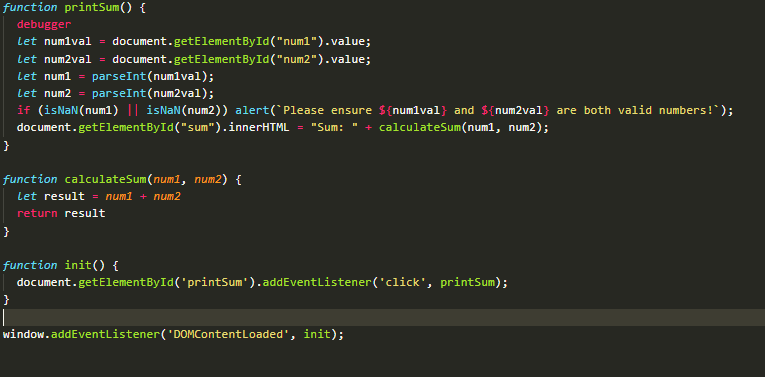

1) The bug was that the text input element always has a type of string, so instead of adding the two numbers, it was concatenating them instead.
2) I would fix it by calling `parseInt` on each of `num1` and `num2` to ensure they are both numbers when they are passed to the `calculateSum` function. I also would add additional error messages to let the user know that they are inputting invalid numbers. If non-integer numbers should be allowed, then `parseFloat` could be used instead. (an evil solution would be to just `eval` a JS string that has the two numbers with a `+` sign concatenated between them)

